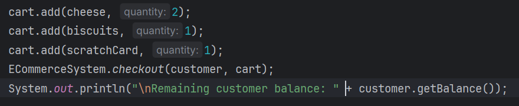
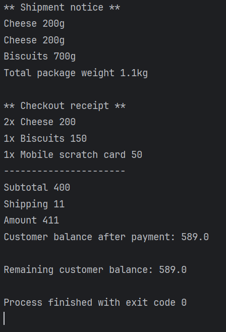
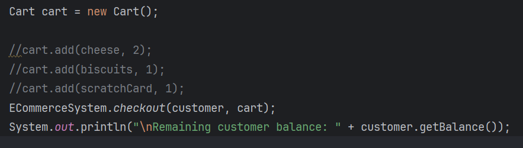
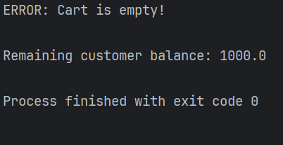
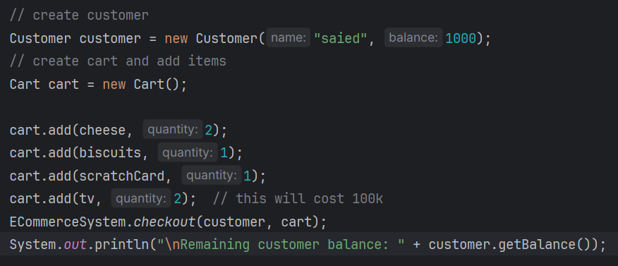
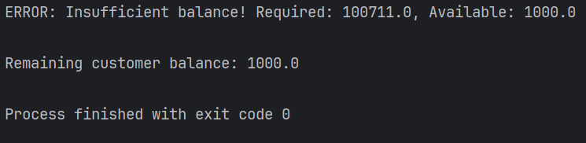
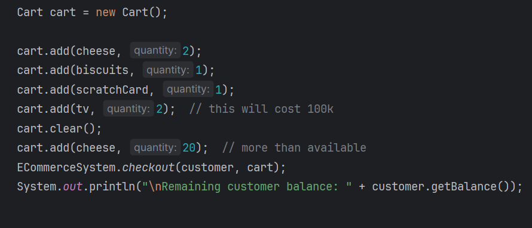
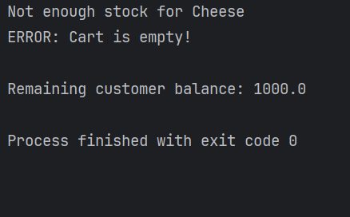
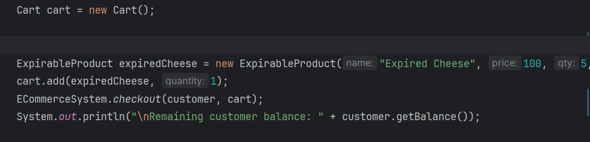
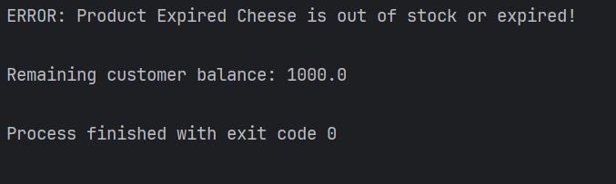

# Fawry Quantum Internship Task

This project solves the e-commerce system task assigned during the Fawry Quantum Full Stack Internship Challenge using Java. The system handles inventory, cart, product types, and checkout logic.

## Running Tests

Tests are located in the `tests` folder. To run:

